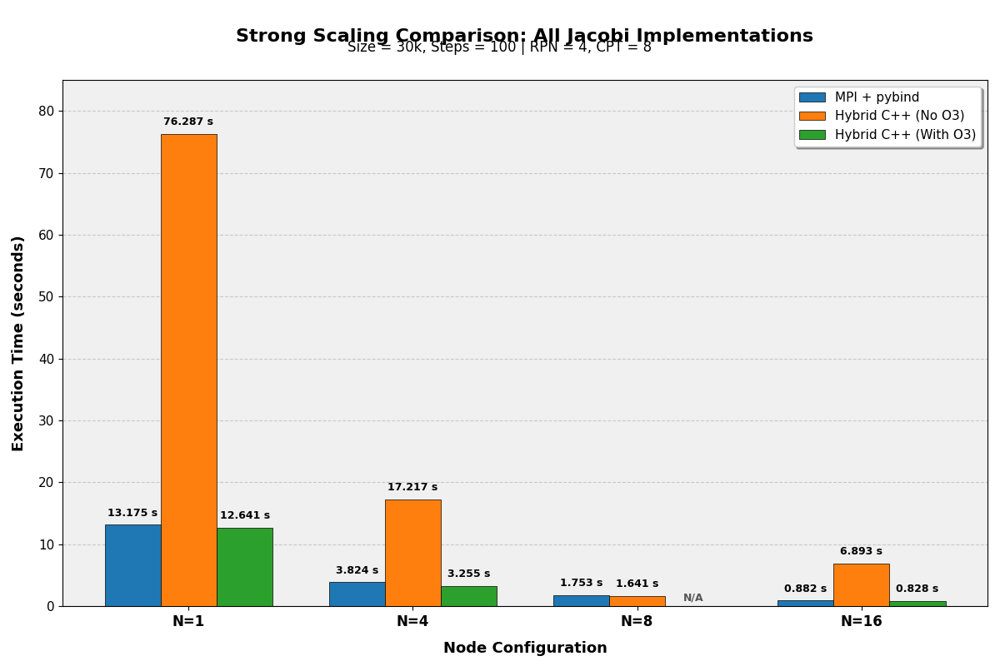

# python


How much performance does Python actually cost in HPC, and where does it stop mattering? Two stencil
problems taken from a single Python process out to 64 MPI ranks and 64 GPUs, measured against the
native C++ they wrap.

| Project | Question | Implementations |
|---|---|---|
| [`pybind11-jacobi/`](pybind11-jacobi/) | What does driving a C++ solver from Python cost? | Serial C++ · MPI+OpenMP C++ · CuPy GPU — all called from Python |
| [`game-of-life/`](game-of-life/) | Which Python parallelism actually helps a stencil? | NumPy vectorised · mpi4py distributed · Numba JIT/njit/stencil |

**What the runs showed**

- **pybind11 overhead is 4–17%**, and it doesn't fall cleanly with scale: 4.3% at one node, **17% at
  four**, 6.0% at sixteen. Single runs, so the middle point may be noise — but it is the measured
  spread, and quoting only the 4–6% ends of it would be picking.
- **The GPU advantage shrinks as you scale.** 8.4× at one node, 3.5× at sixteen. Communication catches
  up with compute.
- **One node of GPUs gets within ~1.8× of sixteen CPU nodes.** 4 A100s take 1.57 s; 64 CPU ranks
  across 16 nodes take 0.88 s. The GPUs do *not* win that comparison — they lose it by 1.8× while
  using a sixteenth of the nodes.
- **Naive Python is not the baseline anyone should quote.** The interesting comparison is *vectorised*
  or *compiled* Python against C++, and that gap is small.

**Stack:** Python 3.11 · NumPy · pybind11 · mpi4py · CuPy · Numba · OpenMPI · OpenMP · SLURM

**Where it ran:** Leonardo Booster at CINECA — 30,000² grid, 100 steps, 4 ranks per node, 8 threads per
rank, one A100 per rank on the GPU runs.

## pybind11 Jacobi — Python cost vs native C++

Same solver, three back-ends, all invoked from a Python driver.

| Nodes | Ranks | MPI + pybind11 | Native C++ hybrid `-O3` | Overhead |
|---:|---:|---:|---:|---:|
| 1 | 4 | 13.18 s | 12.64 s | 4.3% |
| 4 | 16 | 3.82 s | 3.26 s | 17% |
| 16 | 64 | 0.88 s | 0.83 s | 6.0% |

→ **Python is the driver, not the bottleneck.** The C++ extension holds the grid, does the halo
exchange and runs the stencil; Python calls one method per solve.

The absolute overhead is ~0.55 s at 1 and 4 nodes but only 0.05 s at 16, which is not what a fixed
per-call cost looks like — a call-boundary explanation predicts a roughly constant absolute cost, so
something else is moving. With single runs and no repeats there isn't enough evidence to say what.
Treat the percentages as a range, not a trend.



### GPU with CuPy

| Nodes | Tasks / GPUs | CuPy | MPI + pybind11 (CPU) | GPU speedup |
|---:|---:|---:|---:|---:|
| 1 | 4 | 1.57 s | 13.18 s | **8.4×** |
| 4 | 16 | 0.46 s | 3.82 s | 8.3× |
| 8 | 32 | 0.30 s | 1.75 s | 5.8× |
| 16 | 64 | 0.25 s | 0.88 s | 3.5× |

- The grid lives on the device as a `cp.ndarray`; the stencil is array slicing applied in place
- Each rank pins itself with `cp.cuda.Device(rank % 4)`
- Halo exchange stages through **host** buffers rather than using CUDA-aware MPI

→ **The speedup halves between 1 and 16 nodes.** Per-GPU work shrinks while the halo exchange cost
stays fixed — and staging halos through the host makes that worse. CUDA-aware MPI, as used in
[`jacobi-poisson-solver`](https://github.com/prabhkodes/jacobi-poisson-solver), is the fix.

Full build commands and details in [`pybind11-jacobi/README.md`](pybind11-jacobi/README.md).

## Game of Life — which Python parallelism helps

| Implementation | Approach |
|---|---|
| [`serial.py`](game-of-life/src/serial.py) | All eight neighbour shifts via `np.roll`, one vectorised pass |
| [`mpi.py`](game-of-life/src/mpi.py) | Row-wise decomposition, `Sendrecv` ghost rows, `Gather` per frame |
| [`numba_bench.py`](game-of-life/src/numba_bench.py) | Five strategies benchmarked head to head |

The Numba benchmark compares NumPy slicing, `@jit` loops, `@njit(parallel=True)` with `prange`,
`@jit(forceobj=True)`, and the `@stencil` decorator on a 1000² grid for 100 steps — each with a warmup
call before timing, since the first call pays compilation.

<p align="center">
  
</p>

## Known issues and corrections

Re-read against its own tables in **September 2026**:

| # | Found | Issue | Status |
|---|---|---|---|
| 1 | Sep 2026 | **"CuPy on 4 GPUs beats 16 CPU nodes"** contradicted the table directly below it — 1.57 s is slower than 0.88 s, not faster | **Corrected.** Restated as "within ~1.8×, on a sixteenth of the nodes" |
| 2 | Sep 2026 | **"pybind11 overhead is 4–6%"** quoted the two lowest of three measurements and skipped the 17% at 4 nodes | **Corrected** to the full 4–17% range |
| 3 | Sep 2026 | The overhead is ~0.55 s absolute at 1 and 4 nodes but 0.05 s at 16 — inconsistent with the "fixed call-boundary cost" explanation the page gave | **Flagged, unexplained.** Needs repeated runs to tell noise from a real effect |

**Still open**

- **No repeats anywhere in this repo.** Every number is a single run, which is why issue 3 can't be
  resolved from the committed data. Re-running each configuration 5× would settle it
- **The GPU halo path stages through host buffers**, so the CuPy numbers are a floor, not the
  achievable GPU result. CUDA-aware MPI is the fix and was never wired up here
- **Numba benchmark output isn't committed** — the script prints to stdout and nothing captured it

## Caveats

| Caveat | Detail |
|---|---|
| **Timings are single runs** | No repeats or error bars; treat small differences as noise |
| **GPU halos stage through the host** | Deliberate, to sidestep CUDA-aware MPI setup — but it costs, and it's part of why the GPU advantage falls off |
| **Numba benchmark numbers aren't committed** | The script prints them; the plots in this repo are from the Jacobi runs |
| **`numba.py` was renamed to `numba_bench.py`** | The original shadowed the `numba` package, so `python3 numba.py` failed with `ImportError: cannot import name 'jit' from 'numba'`. The documented command could never have worked |

## Layout

```
pybind11-jacobi/
  serial/       C++ CMesh + CSolver exposed via pybind11
  parallel/     + MPI decomposition and OpenMP threading
  gpu/          CuPy, one A100 per rank
game-of-life/
  src/          serial.py, mpi.py, numba_bench.py
  results/      animations
```

## Dependencies

```bash
pip install numpy matplotlib mpi4py numba cupy pybind11 pillow
```

Plus OpenMPI and libomp for the compiled extensions.

## Where this came from

| | |
|---|---|
| Course | *P1.10 — Python for HPC*, MHPC, ICTP / SISSA Trieste, 2025–26 |
| Cluster | Leonardo Booster, CINECA |
| Related | The same Jacobi problem in native Fortran/C++ across four parallel models: [`jacobi-poisson-solver`](https://github.com/prabhkodes/jacobi-poisson-solver) |
